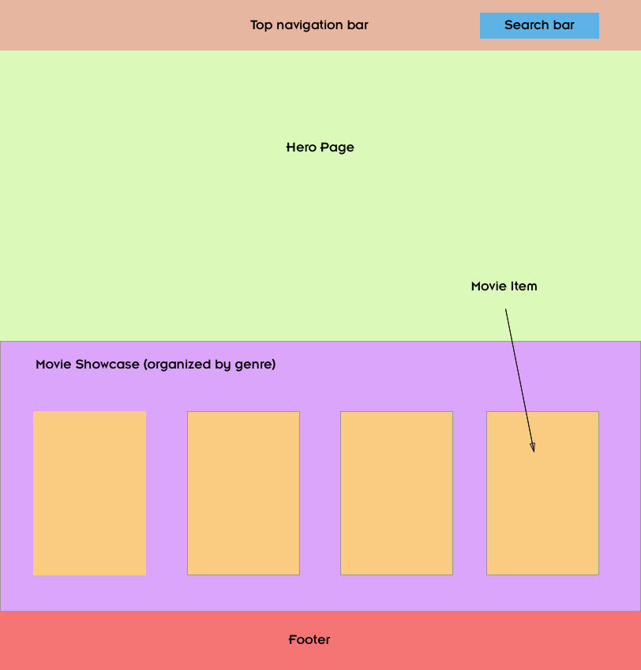
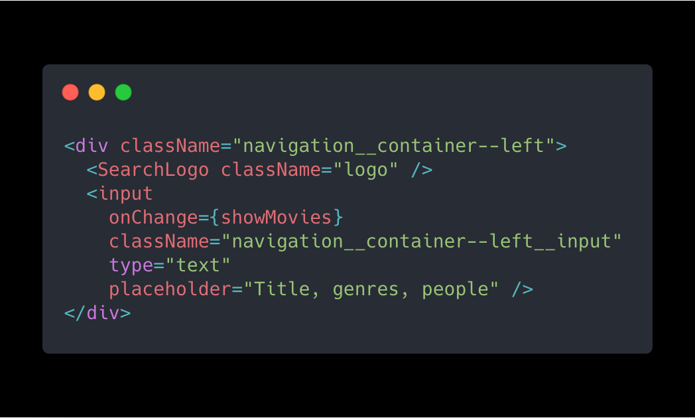

[Demo here](http://netflix-react-clone.surge.sh/)

[Code here](https://github.com/AndresXI/Netflix-Clone)

When I first discovered The Movie Database API I became intrigued by the amount of data there was. At the time I was just getting myself into learning React. So I thought to myself: "How can I use this API to practice the skills I've just learned?". Movies + an awesome UI...Netflix Clone! I've decided to clone the Netflix UI. Initially I didn't realize the hurdles and challenges I would need to overcome, I was just eager to get started! I would like to describe the process, methodology, and challenges I went trough to make this project come alive. I hope this is useful to others who are just getting started with front-end development. 

## The Tech
The reason I chose the technologies I've used was primarily because I've just began learning them (back in 2018) and nothing else. They are:

- React
- Redux
- Sass (css preprocessor) 
- Webpack
- Sketch (design toolkit)

## Breaking Down the UI
Before I began to write code I broke down the UI into components. I figured out which components would receive data and which wouldn't. For doing UI sketches I like to use [Sketch](https://www.sketch.com/). I first start with a rough sketch, just to get a feel for the UI and to get the project started. Later down the road I end up deleting stuff or adding more features. For simplicity, I knew the top navigation bar, footer, and search bar would be static (no data). Whereas the hero page and each individual movie item should be rendered in a dynamic way. Again I am oversimplifying the project so I can get started easily. I am not worrying about event handlers, ui issues, or animations. I just want a rough overview of the components I think are essential to the project.




## Setting Up The project
I Initialized the project with webpack to learn how create-react-app worked behind the scenes. You can find the config file [here](https://github.com/AndresXI/Netflix-Clone/blob/1c657675e6/webpack.config.js)

I then set the project folder structure. Components usually don't have any state and containers do have state. Containers would need to be connected to Redux store.
I chose to create a static folder to keep my sass files and images.

```
src  
│
└───components
|
└───containers
|
└───static
│   │
│   └───images
│   |    │   file111.png
│   |    │   file112.png
│   |    │   ...
│   └───sass
│       │   styles.css
│       │   ...
│       |
└───index.js
└───index.html
.webpack.config.js
```

Because I wouldn't be using any css frameworks I had to find a way to make my sass modular and expandable. I decided to separate my stylesheets into <i>Partials</i>. The separate files represent different components. We then <i>import</i> our partials into one master styelsheet. Ideally I tried using the 7-1 pattern ([read more here](https://www.learnhowtoprogram.com/user-interfaces/building-layouts-preprocessors/7-1-sass-architecture)) but I deleted some stuff to fit my needs. By doing this I was able to implement the Block-Element-Modifier architecture seamlessly. Eventually this is how my main sass file ended up looking
``` scss
// File style.scss
@import "abstracts/functions";
@import "abstracts/mixins";
@import "abstracts/variables";

@import "base/animations";
@import "base/base";
@import "base/typography";
@import "base/utils";

@import "components/search";
@import "components/movie";
@import "components/movieOriginals";
@import "components/movieShowcase";

@import "layout/footer";
@import "layout/header";
@import "layout/navigation";
```


## Challenges
Talking about the challenges I faced will be beneficial to give insight on the difficulties I had to overcome. After all it is because of these challenges that I was able to grow my skillset.

### Search Bar
Right from the start I knew this feature would be a hassle. I focused on two main aspects. The functionality--being able to trigger an API request on keydown press--and the css style. When triggering the API request I also had to change the main view into the search content (movie searches). I decided to create a container div and have the search logo and input box as children. I placed the search logo on top of the input box, so everytime the logo was clicked the input box was being triggered. 



I added some styles to hide the input box and only show the search logo. To trigger the fancy animation all did was use some css properties no javascript. All I am doing is manipulating the width of the input box when on focus. Initially the width is 0px and when on focus it is incresed by 22rem (I also added some padding). Here is the sass responsible for that:
```scss
&__input {
  ...
  opacity: 0
  width: 0px;

  &:focus {
    padding-left: 4rem;
    width: 22rem; // here is the width being increased
    opacity: 1;
    ...
  }
}
```
Now for the functionality I passed in a function to the navbar from the Layout component. This function is responsible for getting the user input, making api call,
and triggering the search view by using a boolean (toggleMovieList).
``` javascript
  onSearchHandler = (event) => {
    /** Display the movie list. */
    this.setState({
      toggleMovieList: false
    });

    const userInput = event.target.value;
    /** Pass in the user input to make the API call. */
    this.makeAipCall(userInput);

    /** If the input is empty don't display the movie list. */
    if (userInput === "") {
      this.setState({
        toggleMovieList: true
      });
    }
  }
```
In the main Layout component, I am showing the Navbar, main content, movie searches, and modal. I am always showing the Navbar. I toggle between the main content and the movies searches. The modal is hidden and only triggered when the users clicks a movie item.
```java
<div>
  <Navbar showMovies={this.onSearchHandler} />
  {
    this.state.toggleMovieList ? <MainContent /> : <div
      className="search-container">{this.state.MovieList}</div>
  }

  <Modal show={this.state.toggleModal}
    modalClosed={this.closeModal}
    movie={this.state.movieOverview}
  >
    <MovieDetails movie={this.state.movieOverview} />
  </Modal>
</div>
```

### Showing The Search Results
To show each individual movie component I looped through the search results and created a react component from each item (each item being a single movie object) that I called `Movie`. I then pushed these react components into an array I called `movieRows`. Essentially, I was rendering an array of react components. 
```javascript
    axios.get(url)
      .then(res => {
        const results = res.data.results;
        ...
        /** Loop through all the movies */
        results.forEach((movie) => {
            ...
          /** Set the movie object to our Movie component */
          const movieComponent = <Movie
            movieDetails={() => this.selectMovieHandler(movie)}
            key={movie.id}
            movieImage={movieImageUrl}
            movie={movie} />

           /** Push our movie component to our movieRows array */
            movieRows.push(movieComponent);
          }
        })
        /** Set our MovieList array to the movieRows array */
        this.setState({ MovieList: movieRows });
      })
```
For each individual `Movie` component I passed in a onClick event handler that would toggle the modal and trigger another API call to get information for that particular movie. I called this function `selectMovieHandler`.
``` javascript
  /* Get the appropriate details for a specific
   movie that was clicked */
  selectMovieHandler = (movie) => {
    this.setState({ toggleModal: true });

    let url;
    /** Make the appropriate API call to get the details for a 
     * single movie or tv show. */
    if (movie.media_type === "movie") {
      const movieId = movie.id;
      url = `https://api.themoviedb.org/3/movie/${movieId}?
      api_key=224ce27b38a3805ecf6f6c36eb3ba9d0`;
    } else if (movie.media_type === "tv") {
      const tvId = movie.id
      url = `https://api.themoviedb.org/3/tv/${tvId}?
      api_key=224ce27b38a3805ecf6f6c36eb3ba9d0`;
    }

    axios.get(url)
      .then(res => {
        const movieData = res.data;
        this.setState({ movieOverview: movieData });
      }).catch(error => {
        console.log(error);
      });

  }
```
I set the movie data to an object I called `movieOverview`. And this object is what is being passed to the modal on the Layout component. The modal is a re-usable component that I use for each movie component. To render the movies the way Netflix does, I used flexbox. I set the property `flex` and gave it values of `1 1 auto` (flex-grow, flex-shrink, and flex-basis). I then set a fixed width and length for each movie image. Personally this is where I feel like improvements can be made.
```scss
.movie {
   ...
   flex: 1 1 auto; 

   &__column-poster {
     ...
      height: 25rem;
      width: 17.5rem;
   }
```

## Conclusion
The way I was able to solve theses ui issues was done trough trial and error. I would iterate trough each solution, if it didn't work I would try another solution and iterate on that one. Eventually I came to a solution that I felt comfortable with (and made sense). Most of the time was also spent on stack overflow looking up code. If I didn't know how to implement a feature I would do some research and find a solution that most likely fit my needs. I would change a few things here and there to be able to integrate it into my project. In reality this project was the result of collaborative effort. Thanks to those who suggested possible solutions. I hope this is useful to anyone out there!